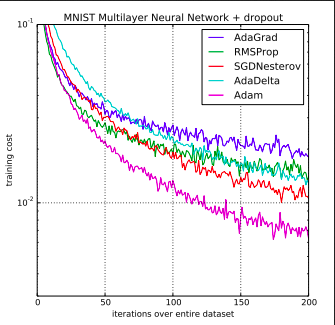

# Comparision-of-Performance-of-Various-Optimizers
 
This Repo contains the code for comparsion of performace of various optimizers for the same Dataset . 
The optimizers were Adam, SGD, AdaGrad, RMSProp, Momentum  

